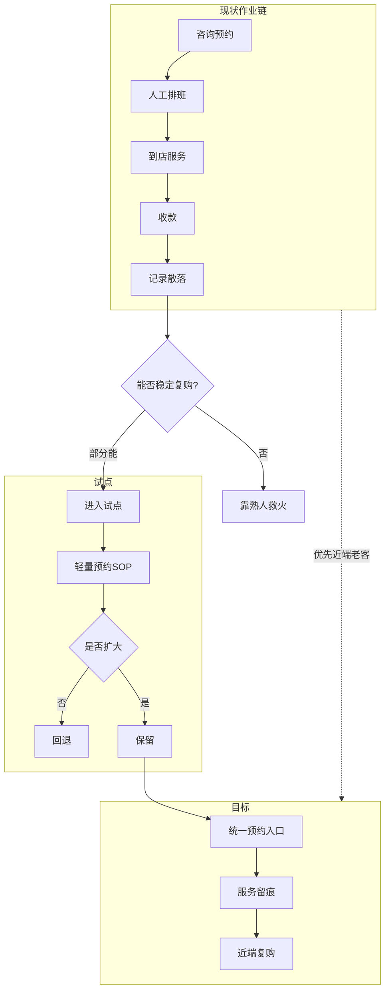

# 席位：流程图（公开演示版）

只输出一个 mermaid 代码块。须含现状、至少一个决策菱形、试点支路、目标链。节点 ID 仅英文数字。

```mermaid
flowchart TD
  subgraph ASIS["现状作业链"]
    A1[咨询预约] --> A2[人工排班]
    A2 --> A3[到店服务]
    A3 --> A4[收款]
    A4 --> A5[记录散落]
  end
  A5 --> D1{能否稳定复购?}
  D1 -->|否| R1[靠熟人救火]
  D1 -->|部分能| P0[进入试点]
  subgraph PILOT["试点"]
    P0 --> P1[轻量预约SOP]
    P1 --> P2{是否扩大}
    P2 -->|否| P3[回退]
    P2 -->|是| P4[保留]
  end
  subgraph TOBE["目标"]
    B1[统一预约入口] --> B2[服务留痕]
    B2 --> B3[近端复购]
  end
  P4 --> B1
  ASIS -.->|优先近端老客| TOBE
```
